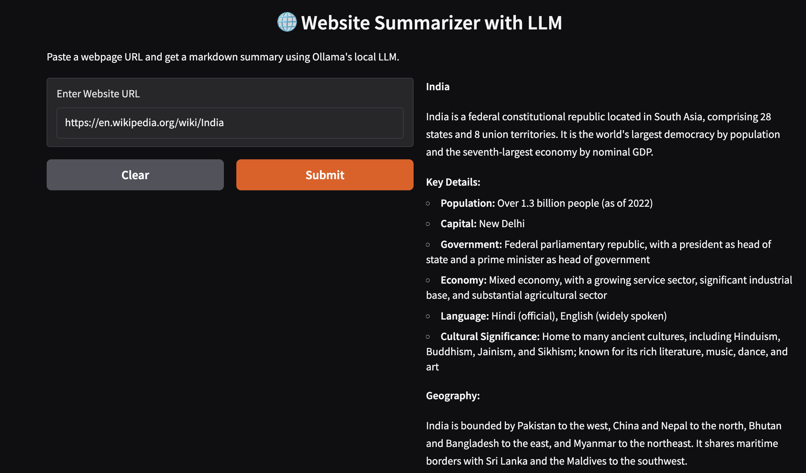

# 🌐 Website Summarizer with Local LLM

> Summarize any public website using a local Large Language Model (LLM) with a simple and elegant interface powered by Gradio and Ollama.

---

## ✨ Overview

This project allows users to input a **URL**, then extracts the content from the webpage, summarizes it using a local LLM (via [Ollama](https://ollama.com)), and displays the result in a clear and readable markdown format.

It’s designed to run **entirely offline** using models like LLaMA or Mistral through Ollama, and features a user-friendly web interface built with Gradio.

---

## 🚀 Features

- Clean and interactive Gradio interface  
- Summarizes content using local Ollama models  
- Extracts meaningful webpage text using BeautifulSoup  
- Markdown-formatted output for readability  
- Fully offline, no OpenAI or cloud API usage  
- Error handling for invalid or broken URLs  
- Lightweight and fast setup

---

## 🛠️ Tech Stack

- **Python 3.8+**
- **Gradio** – For UI
- **Ollama** – For LLM inference
- **BeautifulSoup4** – For HTML parsing
- **Requests** – For fetching website content

---

## 🖼️ Screenshot

Here’s a demo of the user interface:



---

## 🧪 How It Works

1. You enter a website URL into the input box.
2. The system scrapes the webpage and extracts its clean textual content.
3. This text is sent to a local LLM model via `ollama.chat()`.
4. A summarized version of the webpage is generated and displayed as markdown.

---

## ⚙️ Installation & Usage

### 📦 1. Clone the Repository

```bash
git clone https://github.com/iam-anilsolanki/webpage_summarizer.git
cd webpage_summarizer
